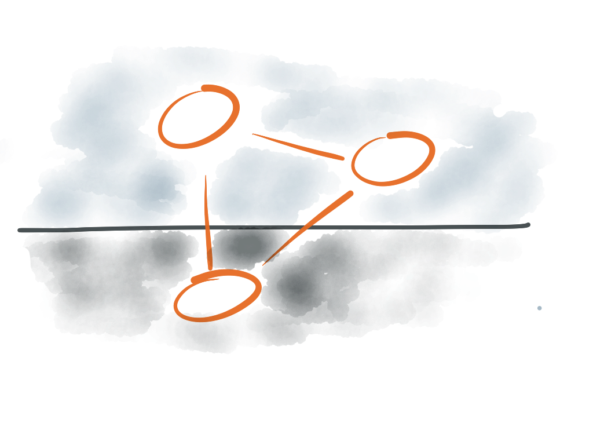

LevelGraph
===========



__LevelGraph__ is a Graph Database. Unlike many other graph database,
__LevelGraph__ is built on the uber-fast key-value store
[LevelDB](http://code.google.com/p/leveldb/) through the powerful
[LevelUp](https://github.com/rvagg/node-levelup) library.
You can use it inside your node.js application.

[](https://travis-ci.org/mcollina/node-levelgraph)

## Install

```
npm install leveldb levelgraph --save
```

## Usage

Initializing a database is very easy:
```
var levelup = require("levelup");
var levelgraph = require("../");
var db = levelgraph(levelup(dir));
```

### Get and Put

Inserting a triple in the database is extremey easy:
```
var triple = { subject: "a", predicate: "b", object: "c" };
db.put(triple, function(err) {
  // do something after the triple is inserted
});
```

Retrieving it through pattern-matching is extremely easy:
```
db.get({ subject: "a" }, function(err, list) {
  expect(list).to.eql([triple]);
  done();
});
```

### Multiple Puts

__LevelGraph__ also supports adding putting multiple triples:
```
var triple1 = { subject: "a1", predicate: "b", object: "c" };
var triple2 = { subject: "a2", predicate: "b", object: "d" };
db.put([triple1, triple2],  function(err) {
  // do something after the triples are inserted
});
```

### Joins

__LevelGraph__ also supports joins:
```
db.put([{
  subject: "matteo",
  predicate: "friend",
  object: "daniele"
}, {
  subject: "daniele",
  predicate: "friend",
  object: "matteo"
}, {
  subject: "daniele",
  predicate: "friend",
  object: "marco"
}, {
  subject: "lucio",
  predicate: "friend",
  object: "matteo"
}, {
  subject: "lucio",
  predicate: "friend",
  object: "marco"
}, {
  subject: "marco",
  predicate: "friend",
  object: "davide"
}], function () {

  var stream = db.joinStream([{
    subject: "matteo",
    predicate: "friend",
    object: db.v("x")
  }, {
    subject: db.v("x"),
    predicate: "friend",
    object: db.v("y")
  }, {
    subject: db.v("y"),
    predicate: "friend",
    object: "davide"
  }]);

  stream.on("data", function(data) {
    // this will print "{ x: 'daniele', y: 'marco' }"
    console.log(data);
  });
});
```

### Deleting

Deleting is easy too:
```
var triple = { subject: "a", predicate: "b", object: "c" };
db.del(triple, function(err) {
  // do something after the triple is deleted
});
```

## TODO

There are plenty of things that this library is missing.
If you feel you want a feature added, just do it and __submit a
pull-request__.

Here are some ideas:

* [ ] Return the matching triples in the JOIN results.
* [ ] Support for Query Planning in JOIN.
* [ ] Design and implement a nicer query interface using promises.
* [ ] Add more database operators.

## Contributing to LevelGraph 

* Check out the latest master to make sure the feature hasn't been
  implemented or the bug hasn't been fixed yet
* Check out the issue tracker to make sure someone already hasn't
  requested it and/or contributed it
* Fork the project
* Start a feature/bugfix branch
* Commit and push until you are happy with your contribution
* Make sure to add tests for it. This is important so I don't break it
  in a future version unintentionally.
* Please try not to mess with the Makefile and package.json. If you
  want to have your own version, or is otherwise necessary, that is
  fine, but please isolate to its own commit so I can cherry-pick around
  it.

## LICENSE - "MIT License"

Copyright (c) 2013 Matteo Collina, http://matteocollina.com

Permission is hereby granted, free of charge, to any person
obtaining a copy of this software and associated documentation
files (the "Software"), to deal in the Software without
restriction, including without limitation the rights to use,
copy, modify, merge, publish, distribute, sublicense, and/or sell
copies of the Software, and to permit persons to whom the
Software is furnished to do so, subject to the following
conditions:

The above copyright notice and this permission notice shall be
included in all copies or substantial portions of the Software.

THE SOFTWARE IS PROVIDED "AS IS", WITHOUT WARRANTY OF ANY KIND,
EXPRESS OR IMPLIED, INCLUDING BUT NOT LIMITED TO THE WARRANTIES
OF MERCHANTABILITY, FITNESS FOR A PARTICULAR PURPOSE AND
NONINFRINGEMENT. IN NO EVENT SHALL THE AUTHORS OR COPYRIGHT
HOLDERS BE LIABLE FOR ANY CLAIM, DAMAGES OR OTHER LIABILITY,
WHETHER IN AN ACTION OF CONTRACT, TORT OR OTHERWISE, ARISING
FROM, OUT OF OR IN CONNECTION WITH THE SOFTWARE OR THE USE OR
OTHER DEALINGS IN THE SOFTWARE.
